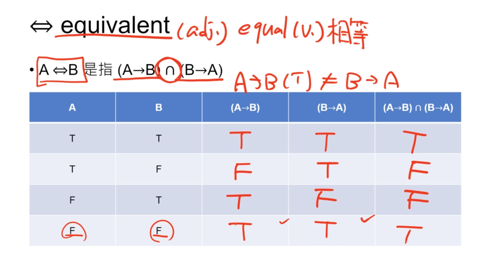

# 離散數學 1 - 形式邏輯 (Formal Logic)

## 1-1 intro to Logics 邏輯導論

- 了解命題的意義與概念
- 了解 `&&` 以及 `||` 的不同
- 了解若 A 則 B 的邏輯意義
- 了解 De Morgan's Law
- 了解恆真式 Tautology
- 用 Python 或是 JavaScript 來完成 Coding Exercise

## Statemant 的命題

一個可以判斷真假的句子，我們稱之為命題
A statement is a sentence that is either true or false

比如：

- [o] 10 < 7
- [x] 他很有鋼琴天份 (因為不知道「他」是誰)
- [o] 15 是質數
- [o] 台北的緯度比高雄還要大
- [o] 3 是質數
- [o] 屈中恆，鈕承澤為同一個人

## 命題的 and & or

我們通常會以一個大寫字母代表一個命題

- 上述的 [o] 我們使用 `A` 來表示，或是 `p`
- 以符號 n 代表「且」
- 以符號 u 代表 「或」
- 上述應該是 U 與倒 U，但方便筆記就先用 n 與 u 替代
- 命題與命題以 n u 互相連接，形成新的命題
- 比如說 A 為 「3 是質數」，B 為「15 是質數」，那問 AnB 就是 「3 和 15 都是質數」，AuB 就是 「3 是質數或是 15 是質數」

A B 同時為 True，AnB 才會是 True
A B 只要其一為 True，AuB 就會是 True

## 若 P 則 Q 命題

### 舉例

- 假設 P = 小明是一位父親，Q = 小明是一位男性
- (若 P 則 Q) = 若小明是一位父親，則小明是一位男性

|P|Q|命題含義|P -> Q|
|------|------|------|-----|
|T|T|若小明是一位父親，則小明是一名男性|T|
|T|F|若小明是一位父親，則小明不是一位男性|F|
|F|T|若小明不是一位父親，則小明是一位男性|T|
|F|F|若小明不是一位父親，則小明不是一位男性|T|

第三點和第四點，在 P 的假設下，Q 都有可能是對的，所以會是 T

比如說若不是一位父親，那會是什麼性別都有可能，可能是男性，也可能是女性，這就是為什麼結果都是 T

只要「假設」 (P) 為 F，則 Q 都有可能發生
只要「假設」是錯的，則「結果」為何都可能發生

所以：

|P|Q|P->Q|
|-|-|-|
|T|T|T|
|T|F|F|
|F|T|T|
|F|F|T|

這個也就是 Truth Table，也就是真偽表

可以再次理解，只要「假設」或「前提」是對的，也就是當 P 為 True 時，P -> Q 的結果，就會因為 Q 為 T 則 T，Q 為 F 則 F

反之，當 P 為 False 時，Q 不論是 T 或 F，則 P -> Q 都會是 T

## 舉例

### 若你考一百分，我就帶你去東京迪士尼

|P|Q|P->Q|
|-|-|-|
|T|T|T|
|T|F|F|
|F|T|T|
|F|F|T|

這邊可能會想問為什麼第三點會成立，也就是「你沒有考一百分，但我帶妳去東京迪士尼」，原因是因為在命題中沒有去確定「你沒有考一百分」的做法，所以「帶你去東京迪士尼」這件事情還是有可能成立的，所以算是合理

這樣說起來 P->Q 的 T 和 F 似乎可以翻譯成「是否合理」(make sense)

### 若你沒有考一百分，我就不帶你去東京迪士尼

|P|Q|P->Q|
|-|-|-|
|T|T|T|
|T|F|F|
|F|T|T|
|F|F|T|

- 沒有考一百分為 T，考了一百分為 F
- 不帶你去東京迪士尼為 T，帶你去東京迪士尼為 F

一樣來看看第三點，命題為：「你考了一百分，但我沒有帶你去東京迪士尼」，也就是說我前提是說你沒考就不帶你去，但也沒說是你考到一百分就帶妳去，所以不帶你去也是有可能的，也就是說，我沒有去確定「你考上了一百分我就怎麼做」這件事，所以不帶你去也是有可能成立的

### 繼續探討

怎麼去定義 P -> Q ?

怎麼談判比較有利？

可以從上面看到，比如說「若你考上一百分，我就帶你去東京迪士尼」這個案例，有一個重點就是在真偽表的第三與第四種狀況：

|P|Q|P->Q|
|-|-|-|
|T|T|T|
|T|F|F|
|F|T|T|
|F|F|T|

一但 P 為 True，也就是履行了考一百分這個承諾，則責任就會在我，所以 P -> Q 的結果會隨著 Q，也就是自己的 T 或 F 去牽動

但是當對方沒有履行時，我做什麼都是對的，所以 Q 不管 T / F 都會是 T

所以可以用負面假設法，比如說以第二個案例，「若是你沒考一百分，我就不帶你去東京迪士尼」這個案例體現的是：

1. 若你沒考一百分，我就不帶你去，合理
2. 若你沒考一百分，我就(還)帶妳去，合理
3. 若你考了一百分，我就不帶你去，合理，因為並沒有說你考一百分就帶妳去
4. 若你考了一百分，我就帶妳去，合理

負面假設法的用意在於，因為對於對方「履行」這件事給了自己確定的定義，所以會比較吃虧，但相反的，如果沒有明確定義對方「履行」的處理作為，則就像第二個案例一樣，即使對方考到一百分，我帶你去或不帶你去東京迪士尼，都是合理的。

所以總結來說，如果今天我跟妹妹說，欸，你沒考一百分的話我就不帶你去喔，但是今天他考一百分了，我還是不帶他去，就可以跟他說：「我是說你沒考上不帶你去，又沒有說你考上就會帶你去」

因為帶你去這件事，與對方有沒有考上一百分沒有必然的因果關係，我只是去肯定說「如果你沒考一百分」，我就「一定不會帶你去」

但如果今天是跟對方約定說，「如果你考到一百分，我就一定帶你去」，那他考上一百分，就必須造成帶他去迪士尼的結果。但因為我沒說沒考上就不帶你去，所以我還是可以帶他去，這是合理的。

## A -> B === B -> A ?

- P = 小明是一位父親，Q = 小明是一位男性

若 P 則 Q，是對的

但若 Q 則 P 是不對的

所以 A -> B !== B -> A

## 名詞解釋

當命題若 P 則 Q 為 T 時，P 為 「Q 的充分條件」，Q 為 「P 的必要條件」

當命題若 P 則 Q 為 T，若 Q 則 P 也是 T 時，P 為 Q 的充分必要條件，Q 為 P 的充分必要條件

[o] P -> Q 
[o] Q -> P

## equivalent

若 P 則 Q 並不一定是若 Q 則 P

小明是一位父親，故小明是一位男性，但小明是一位男性，並不代表小明會是一位父親

但當 P -> Q 和 Q -> P 都成立時，也就是 

```
(A -> B)n(B -> A)
```

我們可以說這是一個 equivalent



技巧：當 TT 或 FF 時，則 equivalent 成立

```
(A -> B)n(B -> A) // equivalent
```

> A is equivalent to Bs

## Negation 否定命題

A = 小明是一位男性
A' = 小明不是一位男性

> `'` 稱為 prime

(AnB)' = ?
(AuB)' = ?

|A|B|AnB|(AnB)'｜
｜---|---|---|---|
|T|T|T|F|
|T|F|F|T|
|F|T|F|T|
|F|F|F|T|

可以觀察到 (AnB)' 的真假值，與 A 或 B 各自比較的話有什麼共通點？

也就是，當 A 或 B 其一為 F 的話，(AnB)' 就會為 Ｔ

所以 `(AnB)' === (A'uB')`

同樣來看 (AuB)'

|A|B|AuB|(AuB)'｜
｜---|---|---|---|
|T|T|T|F|
|T|F|T|F|
|F|T|T|F|
|F|F|F|T|

可以觀察到，當 A 或 B 兩者都為 F 的話，(AuB)' 才會是 T

所以 `(AuB)' === (A'nB')`

## 結論與簡單記法：De Morgan's Low

(AnB)' = A'uB'
(AuB)' = A'nB'

技法：把 `'` 帶入 AnB 中每一個位置，A -> A'，n -> u，B -> B'

```
A -> A'，n -> u，B -> B' // 以此類推
```

所以 `Au(BnC)'` 就會是 `A'n(B'nC')`

### 在程式上的應用

De Morgan's Low 在程式上是可以使用的，比如說我有一個貪食蛇遊戲，比如說我吃一個果實，吃完果實之後，新的果實會出現在畫面上隨機一個地方。所以比如說這個生成果實的函式 `setUpFruit` 

```js
function setUpFruit() {
    //... how to do?
}

```

這個函式的規定是水果不可以生成在蛇上面，所以我們可能想到用一個 Array 來儲存現在這條蛇在平面圖上的位置與數據，當如果生成的點在這個 Array 時，就再執行一次產生座標

另一個規定是不可以放在原本的位置上面。

假設「生成在蛇身上是」 A，「生成在原本位置」是 B，所以 A' 與 B' 就是「不能生成在蛇身上」與「不能生成在原本位置」，

所以就會是

(A'nB') = (AuB)' => A 或 B 任一個為 T 都不行

```js
function setUpFruit() {
    let isOnSnake = false
    let isOverlapping = false

    // ... do something

    if(!(isOnSnake || isOverlapping)) {
        //...continue
    }

    if(!isOnSnake && !isOverlapping) {
        //...continue
    }
}
```